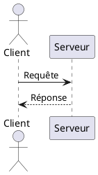
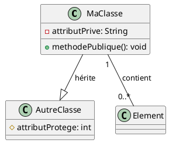
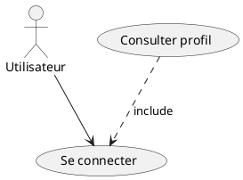
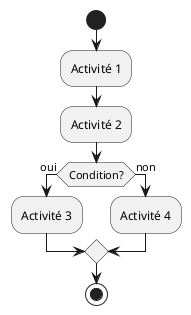

# Convertisseur PlantUML vers Draw.io

Convertit automatiquement des diagrammes UML PlantUML au format Draw.io (.drawio).

## Types de diagrammes supportés

- **Diagrammes de séquence** : interactions entre participants/acteurs
- **Diagrammes de classes** : classes, interfaces, relations (héritage, composition, etc.)
- **Diagrammes de cas d'utilisation** : acteurs, cas d'utilisation, relations include/extend
- **Diagrammes d'activité** : flux d'activités avec conditions et points de décision

## Installation

Aucune installation requise ! Le script utilise uniquement des bibliothèques Python standard.

```bash
chmod +x plantUML_drawio.py
```

## Utilisation

### Conversion d'un seul fichier

```bash
python3 plantUML_drawio.py diagram.puml
```

Génère automatiquement `diagram.drawio` dans le même répertoire.

### Spécifier un nom de sortie

```bash
python3 plantUML_drawio.py diagram.puml -o mon_diagramme.drawio
```

### Convertir plusieurs fichiers

```bash
python3 plantUML_drawio.py *.puml
```

Génère un fichier `.drawio` pour chaque fichier `.puml` trouvé.

### Exemples spécifiques

```bash
# Convertir tous les diagrammes de séquence
python3 plantUML_drawio.py sequence_*.puml

# Convertir avec chemin relatif
python3 plantUML_drawio.py ../diagrams/mydiagram.puml
```

## Exemples

Le répertoire contient des exemples de chaque type de diagramme :

- `example_sequence.puml` - Système de commande en ligne
- `example_class.puml` - Système de gestion de bibliothèque
- `example_usecase.puml` - Système bancaire
- `example_activity.puml` - Processus de commande

Pour générer tous les exemples :

```bash
python3 plantUML_drawio.py example_*.puml
```

## Syntaxe PlantUML supportée

### Diagrammes de séquence



**Éléments supportés:**
- `actor` : acteurs (représentés avec icône bonhomme)
- `participant` : participants (boîtes rectangulaires)
- `->` : message synchrone
- `-->` : message de retour (flèche pointillée)
- Alias avec `as`

### Diagrammes de classes



**Éléments supportés:**
- `class` : classes
- `interface` : interfaces
- `abstract class` : classes abstraites
- Attributs et méthodes avec visibilité (+, -, #)
- Relations :
  - `--|>` : héritage
  - `..|>` : implémentation
  - `--` : association
  - `o--` : agrégation
  - `*--` : composition

### Diagrammes de cas d'utilisation



**Éléments supportés:**
- `actor` : acteurs
- `usecase` : cas d'utilisation (ellipses)
- `-->` : association acteur-cas d'utilisation
- `..>` : relations include/extend

### Diagrammes d'activité



**Éléments supportés:**
- `start` : point de départ
- `stop` : point d'arrêt
- `:activité;` : activités (boîtes arrondies)
- `if/then/else/endif` : conditions (losanges)

## Ouvrir les fichiers générés

Les fichiers `.drawio` peuvent être ouverts avec :

1. **Draw.io en ligne** : https://app.diagrams.net/
   - Ouvrir le fichier depuis votre ordinateur
   - Aucune installation requise

2. **Draw.io Desktop** : https://github.com/jgraph/drawio-desktop/releases
   - Application autonome pour Windows, Mac, Linux

3. **Extension VS Code** : "Draw.io Integration"
   - Éditer directement dans VS Code

## Limitations

- Parsing simplifié de PlantUML (pas d'interprétation complète)
- Mise en page automatique basique (peut nécessiter des ajustements manuels)
- Notes et commentaires PlantUML non convertis
- Styles et couleurs personnalisés non supportés
- Certaines syntaxes avancées PlantUML peuvent ne pas être reconnues

## Dépannage

### "Type de diagramme non reconnu"

Le script ne peut pas identifier le type de diagramme. Vérifiez que :
- Le fichier contient `@startuml` et `@enduml`
- Le fichier utilise les mots-clés appropriés (`participant`, `class`, `usecase`, `start`, etc.)

### "Fichier non trouvé"

Vérifiez le chemin du fichier. Le script accepte :
- Chemins relatifs : `./diagrams/file.puml`
- Chemins absolus : `/home/user/diagrams/file.puml`

### Mise en page incorrecte dans Draw.io

Le convertisseur utilise une mise en page automatique. Vous pouvez :
- Réorganiser manuellement les éléments dans Draw.io
- Utiliser les outils d'alignement de Draw.io (Format > Arrange)
- Appliquer une mise en page automatique dans Draw.io (Arrange > Layout)

## Architecture du convertisseur

Le convertisseur est composé de trois parties principales :

1. **PlantUMLParser** : Parse les fichiers PlantUML et détecte automatiquement le type
2. **DrawIOGenerator** : Génère le XML au format Draw.io
3. **Convertisseurs spécialisés** : Un pour chaque type de diagramme

## Contribution

Pour ajouter le support d'un nouveau type de diagramme :

1. Ajouter le type dans l'enum `DiagramType`
2. Ajouter la détection dans `_detect_diagram_type()`
3. Créer une méthode `_parse_xxx()` dans `PlantUMLParser`
4. Créer une méthode `generate_xxx_diagram()` dans `DrawIOGenerator`
5. Ajouter le cas dans la fonction `convert_plantuml_to_drawio()`

## Licence

Script éducatif libre d'utilisation.
